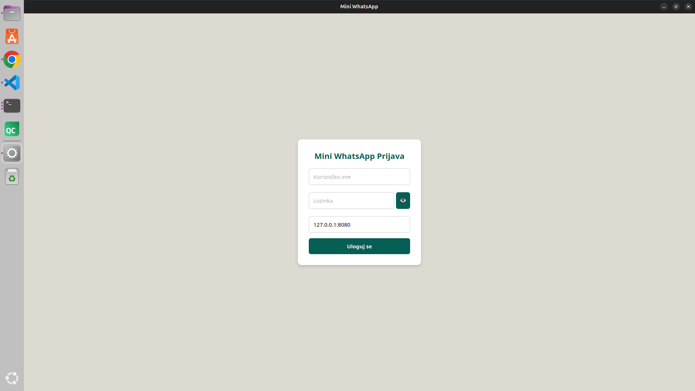
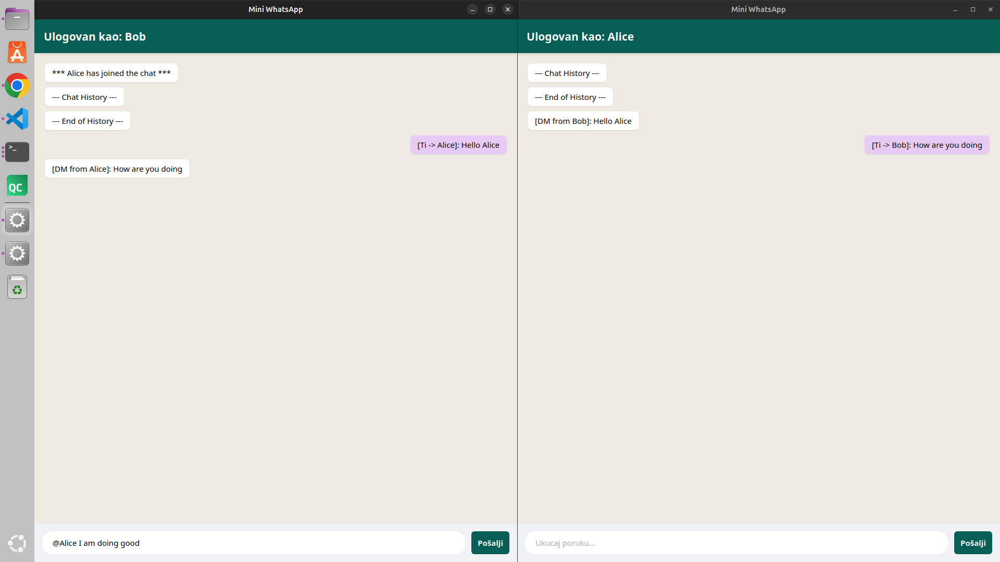
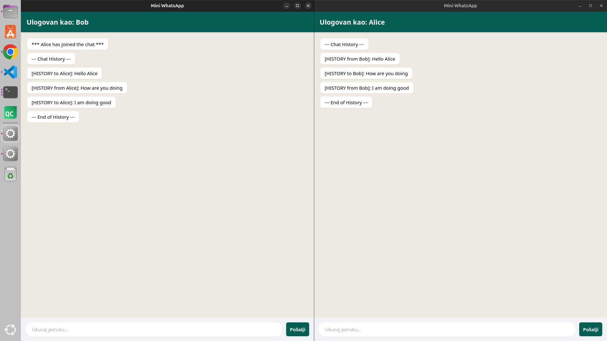

# Mini WhatsApp

## Description
A desktop messaging application that enables secure communication between users.
It uses Diffie-Hellman key exchange and AES-GCM encryption to ensure end-to-end
encrypted messaging, with message history stored in a local database.

## Screenshots

### Login


### Live Chat


### Chat History


## Languages and Technologies
- **Go** — server and client logic
- **Wails** — desktop GUI framework
- **SQLite3** — database for storing messages and users

## Requirements
- Go 1.21+
- Wails (`go install github.com/wailsapp/wails/v2/cmd/wails@latest`)
- SQLite3

## Building and Running

### Development
```bash
# Server
cd server
go run main.go

# Client
cd client
wails dev
```

### Executable Files
```bash
# Server
cd server
go build -o server main.go
./server

# Client
cd client
wails build
./build/bin/mini-whatsapp
```

### Database Initialization
```bash
# From the root directory:
make
```

## Operating System
Executable files are built for **Linux (x86_64)**, tested on Ubuntu 24.04.


## Authors
| Name | Email |
|-----|-------|
| Nikolaj Molčanov | mi23239@alas.matf.bg.ac.rs |
| Stefan Gajić | mi23056@alas.matf.bg.ac.rs |
| Dušan Marić | mi23065@alas.matf.bg.ac.rs |

## Notes
- Server must be started before the client
- Chat history will be visible only after both users have logged in
- Default credentials: `Alice`/`tajna456` and `Bob`/`sifra123`
- Server listens on port `8080`